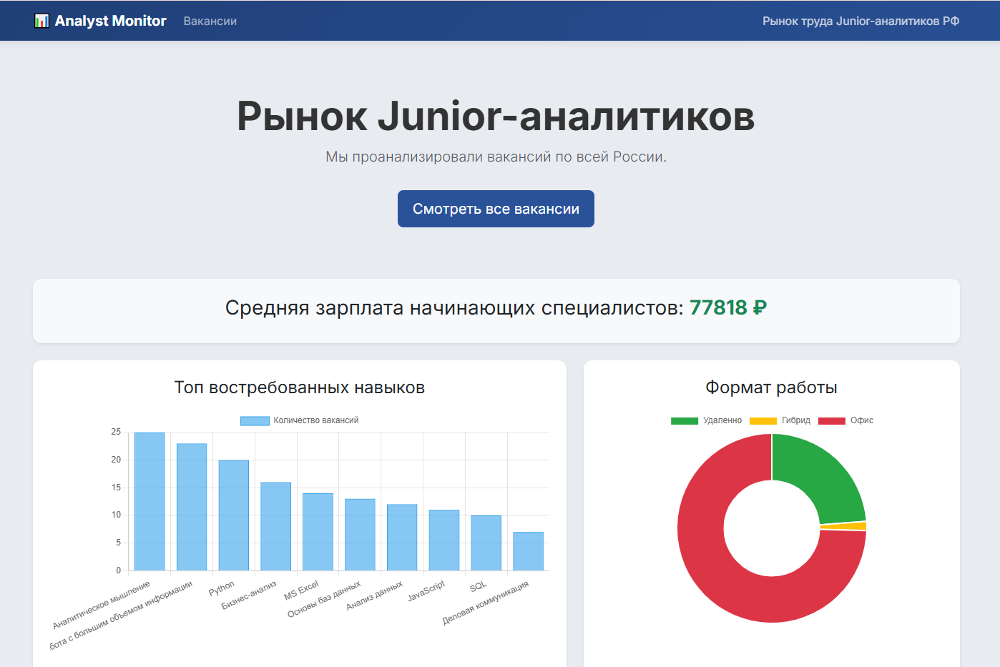
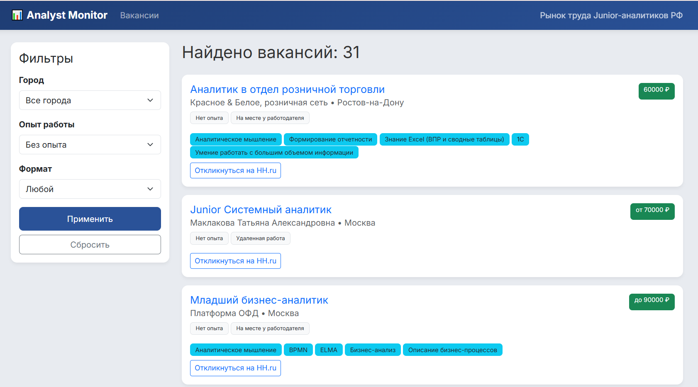

# Junior Analyst Vacancy Monitor

**Веб-сервис для мониторинга рынка труда и анализа требований к начинающим аналитикам в РФ.**

Проект решает проблему поиска первой работы: автоматически собирает вакансии с HeadHunter, очищает их от мусора, фильтрует и показывает наглядную аналитику.

🌐 **Ссылка на рабочий проект:** [https://nadinekozulina.pythonanywhere.com/]

---

## 🛠 Технологии
*   **Python 3.13**
*   **Django 6.0**
*   **SQLite**
*   **API Integration:** `requests` (HeadHunter API)
*   **Frontend:** Bootstrap 5, Chart.js (Визуализация данных)
*   **Deploy:** PythonAnywhere


## Интерфейс

### 1. Главная страница (Дашборд)
Аналитика рынка в реальном времени: средняя зарплата, топ востребованных навыков и распределение по формату работы.


### 2. Поиск вакансий
Удобный список с фильтрами по городу, опыту и удаленке.


---

## Как запустить проект локально

1.  **Клонируйте репозиторий:**
    ```bash
    git clone https://github.com/KozulinaNadezhda/Vacancy_monitor.git
    cd Vacancy_monitor
    ```

2.  **Создайте и активируйте виртуальное окружение:**
    ```bash
    python -m venv venv
    # Для Windows:
    venv\Scripts\activate
    # Для Mac/Linux:
    source venv/bin/activate
    ```

3.  **Установите зависимости:**
    ```bash
    pip install -r requirements.txt
    ```

4.  **Выполните миграции (создание БД):**
    ```bash
    python manage.py migrate
    ```

5.  **Загрузите данные (Запуск парсера):**
    ```bash
    python manage.py import_vacancies
    ```
    *Скрипт скачает свежие вакансии с HH.ru.*

6.  **Запустите сервер:**
    ```bash
    python manage.py runserver
    ```

7.  **Откройте проект в браузере:**
    Перейдите по ссылке: [http://127.0.0.1:8000/]

---

## ⚙️ Автоматизация на сервере
Проект развернут на PythonAnywhere. Настроена регулярная задача (Scheduled Task), которая выполняется **ежедневно в 10:00 МСК**:
1.  Удаляет вакансии старше 10 дней (чистка базы).
2.  Загружает новые вакансии за последние 24 часа.


